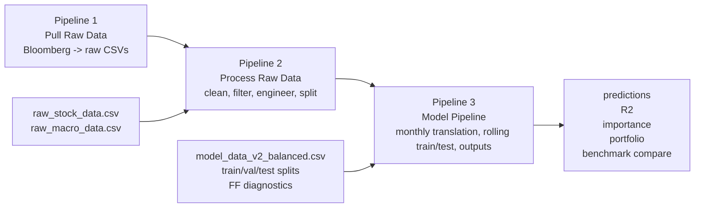
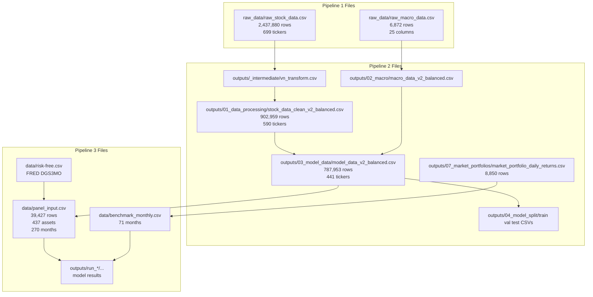
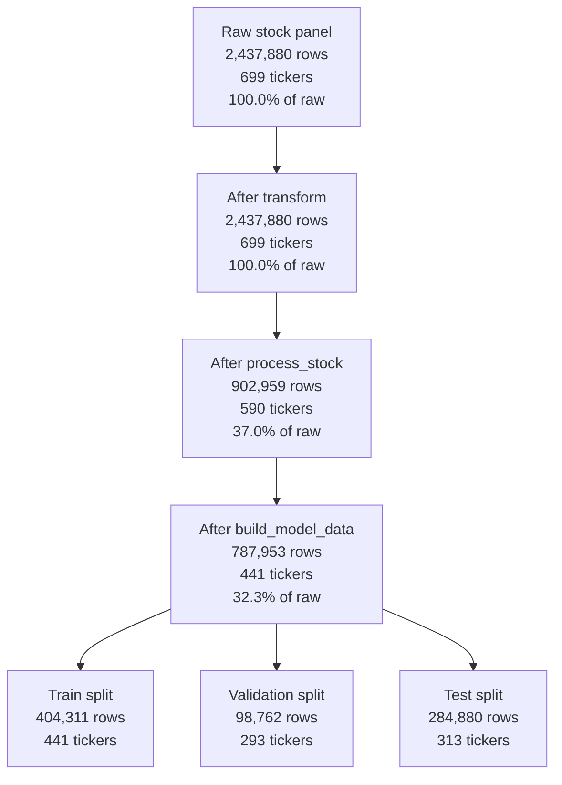
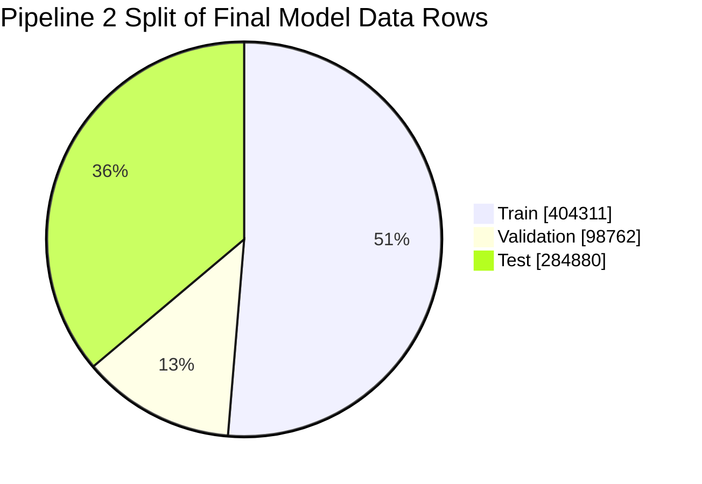
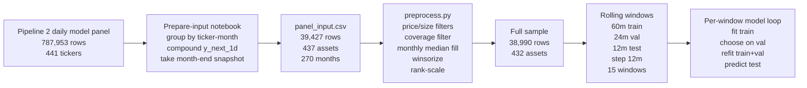
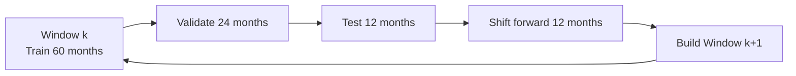
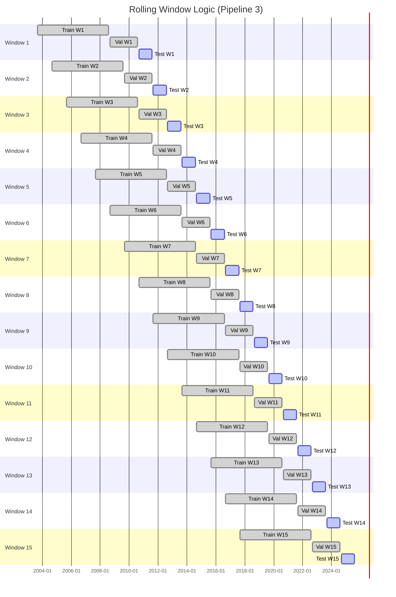
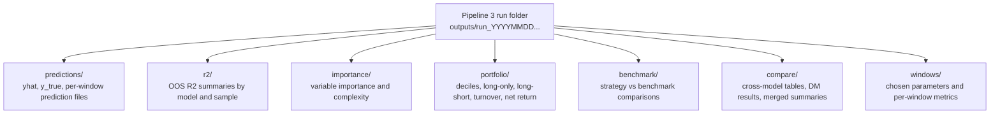

## 1) System Overview

> [!info]
> This is the top-level view.

## 2) File Lineage

> [!info]
> This view focuses on the main file handoffs.

## 4) Filtering Funnel

> [!info]
> This is the best view for understanding where the stock sample gets cut down.

## 5) Pipeline 3 Preparation and Rolling Training Logic

> [!info]
> Pipeline 3 does not train directly on Pipeline 2 daily rows. It first converts them into a monthly panel, then applies another preprocessing layer, then rolls windows through time.

Rolling Window Logic (Pipeline 3)

| Window | Train start | Train end  | Val start  | Val end    | Test start | Test end   |
| -----: | ----------- | ---------- | ---------- | ---------- | ---------- | ---------- |
|      1 | 2003-08-31  | 2008-07-31 | 2008-08-31 | 2010-07-31 | 2010-08-31 | 2011-07-31 |
|      2 | 2004-08-31  | 2009-07-31 | 2009-08-31 | 2011-07-31 | 2011-08-31 | 2012-07-31 |
|      3 | 2005-08-31  | 2010-07-31 | 2010-08-31 | 2012-07-31 | 2012-08-31 | 2013-07-31 |
|      4 | 2006-08-31  | 2011-07-31 | 2011-08-31 | 2013-07-31 | 2013-08-31 | 2014-07-31 |
|      5 | 2007-08-31  | 2012-07-31 | 2012-08-31 | 2014-07-31 | 2014-08-31 | 2015-07-31 |
|      6 | 2008-08-31  | 2013-07-31 | 2013-08-31 | 2015-07-31 | 2015-08-31 | 2016-07-31 |
|      7 | 2009-08-31  | 2014-07-31 | 2014-08-31 | 2016-07-31 | 2016-08-31 | 2017-07-31 |
|      8 | 2010-08-31  | 2015-07-31 | 2015-08-31 | 2017-07-31 | 2017-08-31 | 2018-07-31 |
|      9 | 2011-08-31  | 2016-07-31 | 2016-08-31 | 2018-07-31 | 2018-08-31 | 2019-07-31 |
|     10 | 2012-08-31  | 2017-07-31 | 2017-08-31 | 2019-07-31 | 2019-08-31 | 2020-07-31 |
|     11 | 2013-08-31  | 2018-07-31 | 2018-08-31 | 2020-07-31 | 2020-08-31 | 2021-07-31 |
|     12 | 2014-08-31  | 2019-07-31 | 2019-08-31 | 2021-07-31 | 2021-08-31 | 2022-07-31 |
|     13 | 2015-08-31  | 2020-07-31 | 2020-08-31 | 2022-07-31 | 2022-08-31 | 2023-07-31 |
|     14 | 2016-08-31  | 2021-07-31 | 2021-08-31 | 2023-07-31 | 2023-08-31 | 2024-07-31 |
|     15 | 2017-08-31  | 2022-07-31 | 2022-08-31 | 2024-07-31 | 2024-08-31 | 2025-07-31 |

## 6) Output Taxonomy

> [!info]
> This view is for understanding where the model results are saved and what each output family means.

