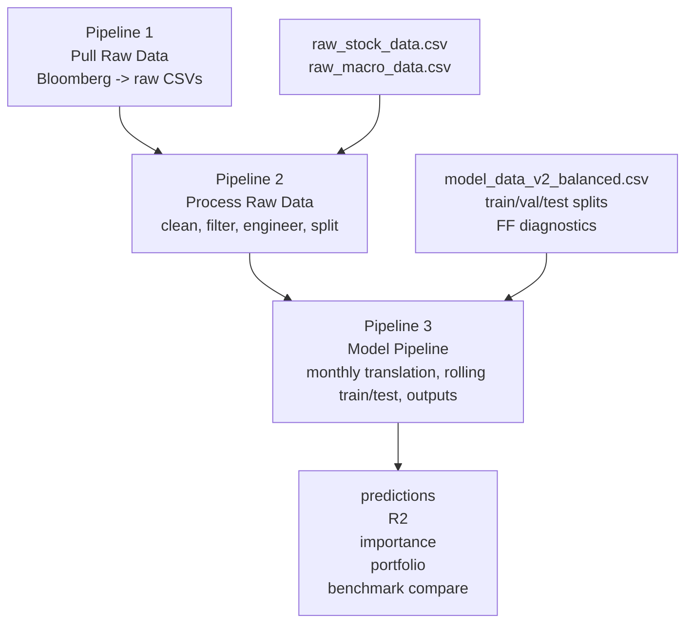
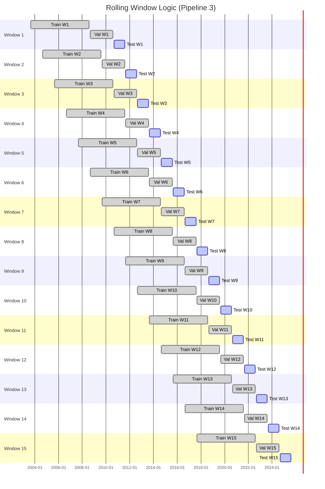

# This is where I put high-level reports of my final year thesis. 

There are 3 main pipelines:

Pipeline 1: Pulling raw data from Bloomberg

Pipeline 2: Processing data & Exploration

Pipeline 3: Appling ML models

*(My code can be found [here](https://github.com/vanthelearner/Vietnam-Equity-Market-Predicting))*

### What's in this repo:
- Models Performance.pdf: Models have been applied (so far, there are more coming). 
- Features Dictionary.md: All the features that will be feed into the models.

*These models and ideas are mainly inspired by the paper [Empirical Asset Pricing via Machine Learning](https://academic.oup.com/rfs/article/33/5/2223/5758276) by Shihao Gu, Bryan Kelly, Dacheng Xiu. My thesis will be focusing in testing out a new dataset, in a new market, and most important with improvement if possible*

---
### Data
Monthly Vietnam Stocks Market from Ho Chi Minh Stock Exchange, and Hanoi Stock Exchange, start from 01-01-2000 to 28-02-2026 (total of unique stocks is 700 different stocks that were used during the three pipelines), all from only Bloomberg.  

---

### Results
**Prediction horizon reviewed:** 180 monthly out-of-sample periods from **2010-08-31** to **2025-07-31**

- 07/03/2026 batch: I would call this batch "Kitchen Sink" batch (since there was no careful feature engineering, everything, every features got put into the models). 
*(more details in the "Models performance.pdf")*

<u>This table is an quick overview of the performance metrics by all models</u>

| Model | R2 OOS Full (monthly) | R2 OOS on large companies (monthly) | R2 OOS on small companies (monthly) | Mean Rank Information coefficient  | Long-only Annualized Sharpe | Long-short Annualized Sharpe | Benchmark Information ratio | Long-short Annualized Return |
| ----- | ----------- | ------------ | ------------ | ------------ | ---------------- | ----------------- | ------------ | ---------- |
| ENET  | 0.0044      | 0.0039       | -0.0003      | 0.0785       | 0.970            | 1.696             | 0.247        | 40.3%      |
| PCR   | 0.0025      | 0.0004       | -0.0014      | 0.0545       | 0.825            | 1.146             | 0.098        | 26.8%      |
| PLS   | 0.0008      | -0.0019      | -0.0034      | 0.0724       | 0.842            | 1.139             | 0.141        | 26.8%      |
| GBRT  | -0.0183     | -0.0096      | -0.0170      | 0.0573       | 0.696            | 0.451             | -0.062       | 7.5%      |
| RF    | -0.0235     | -0.0150      | -0.0102      | 0.0365       | 0.378            | 0.312             | -0.067       | 4.4%       |
| OLS3  | -0.0113     | -0.0116      | -0.0124      | 0.0306       | 0.325            | -0.054            | -0.244       | -4.5%       |
| OLS   | -0.0143     | -0.0588      | -0.0326      | 0.1044       | 1.265            | 1.301             | 0.034        | 32.8%      |

*Note: Although short selling is prohibited in VN, for the purpose of comparison I still include it in*

<u>This table is the performance of market portfolios during the same period</u>

| Benchmark          | Construction                                               | Weighting | Rebalance | Annualized Return | Sharpe |
| ------------------ | ---------------------------------------------------------- | --------- | --------- | ----------------- | ------ |
| `VN_Market_Index`  | Bloomberg VN market index level                            | Index     | None      | 7.7%              | 0.47   |
| `Top30_Static_EW`  | Top 30 by market cap at the first test date (`2010-08-31`) | Equal     | Static    | 11.4%             | 0.59   |
| `Top30_Static_VW`  | Top 30 by market cap at the first test date (`2010-08-31`) | Value     | Static    | 12.0%             | 0.63   |
| `Top30_6MRebal_EW` | Top 30 by market cap, reselected every 6 months            | Equal     | 6-month   | 7.1%              | 0.43   |
| `Top30_6MRebal_VW` | Top 30 by market cap, reselected every 6 months            | Value     | 6-month   | 7.9%              | 0.47   |

<u>This table is the features importance that each model pick *(see Features Dictionary.md for details of each features)*</u> 

| Model | Top 1                    | Top 2                  | Top 3              | Top 4                | Top 5                   |
| ----- | ------------------------ | ---------------------- | ------------------ | -------------------- | ----------------------- |
| ENET  | mom1m (0.789)            | Shares_Out (0.566)     | cfp (0.039)        | ROE_Reported (0.000) | EBITDA (0.000)          |
| OLS   | FCF (0.120)              | US_Bond_10Y (0.079)    | std_turn (0.077)   | mom6m (0.065)        | Hong_Kong_Index (0.061) |
| PCR   | Oper_CF (0.075)          | agr (0.075)            | dollar_vol (0.074) | Cur_Assets (0.074)   | Inventory_BS (0.074)    |
| PLS   | P/B (0.709)              | Price (0.107)          | Shares_Out (0.061) | FCF (0.038)          | std_turn (0.035)        |
| GBRT  | US_FedFunds_Rate (0.519) | cash_ratio (0.159)     | mom36m (0.122)     | mom1m (0.119)        | Indonesia_Index (0.111) |
| RF    | Indonesia_Index (0.133)  | Comm_Gold_Spot (0.073) | USD_VND_FX (0.063) | US_GDP_QoQ (0.061)   | Hong_Kong_Index (0.059) |
| OLS3  | me (1.215)               | be_me (-0.004)         | ret_12_1 (-0.212)  |                      |                         |

- More batches are coming...
---
 
 

# How the systems work end to end

## 1) System Overview

> [!info]
> This is the top-level view.

Rolling Window Logic (Pipeline 3)

| Window | Train start | Train end  | Val start  | Val end    | Test start | Test end   |
| -----: | ----------- | ---------- | ---------- | ---------- | ---------- | ---------- |
|      1 | 2003-08-31  | 2008-07-31 | 2008-08-31 | 2010-07-31 | 2010-08-31 | 2011-07-31 |
|      2 | 2004-08-31  | 2009-07-31 | 2009-08-31 | 2011-07-31 | 2011-08-31 | 2012-07-31 |
|      3 | 2005-08-31  | 2010-07-31 | 2010-08-31 | 2012-07-31 | 2012-08-31 | 2013-07-31 |
|      4 | 2006-08-31  | 2011-07-31 | 2011-08-31 | 2013-07-31 | 2013-08-31 | 2014-07-31 |
|      5 | 2007-08-31  | 2012-07-31 | 2012-08-31 | 2014-07-31 | 2014-08-31 | 2015-07-31 |
|      6 | 2008-08-31  | 2013-07-31 | 2013-08-31 | 2015-07-31 | 2015-08-31 | 2016-07-31 |
|      7 | 2009-08-31  | 2014-07-31 | 2014-08-31 | 2016-07-31 | 2016-08-31 | 2017-07-31 |
|      8 | 2010-08-31  | 2015-07-31 | 2015-08-31 | 2017-07-31 | 2017-08-31 | 2018-07-31 |
|      9 | 2011-08-31  | 2016-07-31 | 2016-08-31 | 2018-07-31 | 2018-08-31 | 2019-07-31 |
|     10 | 2012-08-31  | 2017-07-31 | 2017-08-31 | 2019-07-31 | 2019-08-31 | 2020-07-31 |
|     11 | 2013-08-31  | 2018-07-31 | 2018-08-31 | 2020-07-31 | 2020-08-31 | 2021-07-31 |
|     12 | 2014-08-31  | 2019-07-31 | 2019-08-31 | 2021-07-31 | 2021-08-31 | 2022-07-31 |
|     13 | 2015-08-31  | 2020-07-31 | 2020-08-31 | 2022-07-31 | 2022-08-31 | 2023-07-31 |
|     14 | 2016-08-31  | 2021-07-31 | 2021-08-31 | 2023-07-31 | 2023-08-31 | 2024-07-31 |
|     15 | 2017-08-31  | 2022-07-31 | 2022-08-31 | 2024-07-31 | 2024-08-31 | 2025-07-31 |

